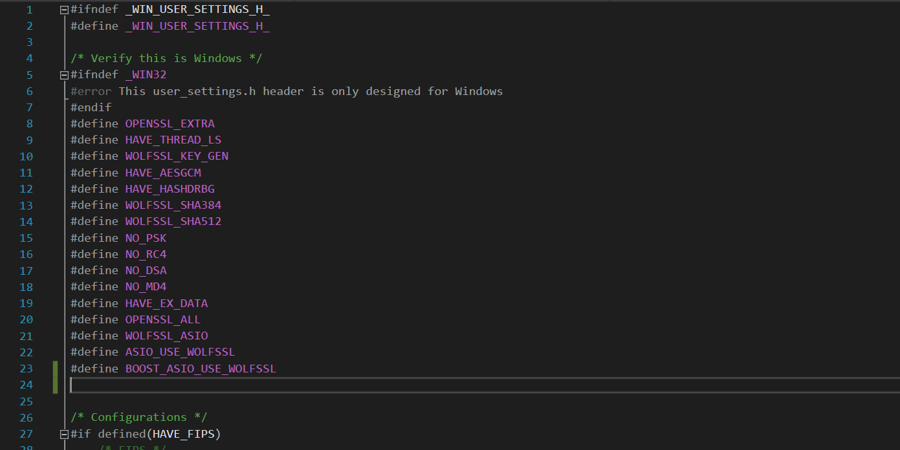

# FIPS
## Table of Contents  
1. [Boost:](#boost)
   - [Download and Install:](#boost_download_and_install)
   - [Integration to Visual Studio Project:](#integration)
2. [OpenSSL:](#openssl)  
   - [OpenSSL guide](#openssl_guide)
   - [Prbolems & Solutions](#openssl_problems_solutions)
3. [WolfSSL:](#wolfssl)  
   - [Prerequisites:](#prerequisites)
   - [Download & Install:](#wolfssl_download_and_install)
   - [Build & Configuration:](#build_and_config)
   - [Integration to Visual Studio Project:](#integration_wolfssl)
   - [Prbolems & Solutions](#wolfssl_problems_solutions)

_______
# Boost: #
<a name="boost"/>

### Boost: Download and Install ###
<a name="boost"/>
<a name="boost_download_and_install"/>
1. Download boost 1.72 library from: https://www.boost.org/users/history/version_1_72_0.html <br />
2. Extract boost folder into: C:\Program Files <br />
3. Open x64 VS 2017 CMD <b> as Administrator (important) </b><br />
4. Enter the following commands:

   - “bootstrap vc141” - (vc141 for visual studio 2017 version)<br />
     
   - “b2” - (for building boost libraries)<br />
      
      
5. Add boost to environment variables:

   - Add new environment variable named “include” and for it’s value insert boost library path (C:\Program Files\boost_1_72_0 )<br />
      )<br />
   - Add another environment variable named “LIB” and enter it it’s value to be : C:\Program Files\boost_1_72_0\stage\lib <br />
     <br />
Note: the path in the pictures above should be set  as described in 1,2 above.<br />
 6. Build boost libraries:
    -  *Visual Studio 2017 - 32bit Build* <br /> 
    
          ```
          b2 --build-dir=build/x86 address-model=32 threading=multi --build-type=complete --stagedir=./stage/x86 --toolset=msvc-14.1 -j 12 <br />
          ```
 
    -  *Visual Studio 2017 - 64bit Build* <br />
    
          ```
          b2 --build-dir=build/x64 address-model=64 threading=multi --build-type=complete --stagedir=./stage/x64 --toolset=msvc-14.1 -j 12 <br />
          ```
  
    - Go to environment variables and modify LIB and change it’s path to be: C:\Program Files\boost_1_72_0\stage\x64\lib
    
      <br />
    - Add to environment variable named “path” the value: C:\Program Files\boost_1_72_0\stage\x64\lib

For more information:<br />
https://www.youtube.com/watch?v=5afpq2TkOHc
 _____ 
 
### Boost: Integration to Visual Studio Project ###
<a name="integration"/>

  1. Open your project in visual studio <br />
  2. Right click on your project -> properties <br />
  3. Set configuration to <b> All configuration! important! </b> <br />
  4. Go to Configuration properties -> VC++ Directories, add the path: “C:\Program Files\boost_1_72_0”  to Include directories and to library directories
      -  <br />
  5. Go to C/C++ General and add “C:\Program Files\boost_1_72_0”  to Additional Include Directories, and set SDL checks to No.
      -  <br />
  6. Go to Linker -> General and add the path “C:\Program Files\boost_1_72_0\stage\lib” to  Additional Library Directories
      - <br />
# OpenSSL: #
<a name="openssl"/>

### OpenSSL guide: ###
<a name="openssl_guide"/>

https://nextbigthings.info/secured-tls-connection-using-boost-asio-and-openssl-for-windows/ <br /> <br />
This guide explains how to download and  install OpenSSL. <br />
Moreover, it shows how to integrate OpenSSL library into an example of a boost ssl client and server project,<br /> the same example as we used. <br />

For more info checkout OpenSSL installation guide: <br /> 

https://github.com/openssl/openssl/blob/master/INSTALL.md#building-openssl


### Problems & Solutions ###
<a name="openssl_problems_solutions"/>

This section overview problems we encountered and solutions: </br>

1. Problem: Linking errors
<br />

Solution: Add the following two #pragma commands <br />


2. Problem & Solution: Can't find or open PDB files </br>


3. Problem: failing to use OpenSSL commands in CMD </br>
   Solution: add OPENSSL_CONF variable to environment variables with the path of \your openssl-master folder\apps\openssl.cnf 
   

# WolfSSL: #
<a name="wolfssl"/>

## Prerequisites: ## 
<a name="prerequisites"/>


### Cygwin: ###

1. Download & Install Cygwin from the "Cygwin" section in the following link:
   https://www.wolfssl.com/documentation/wolfssl-manual/chapter02.html 
2. Follow 1-11 instructions.

## Download & Install: ##
<a name="wolfssl_download_and_install"/>

1. Download wolfssl-5.3.0-gplv3-fips-ready.zip edition from: https://www.wolfssl.com/download/
2. Unzip the folder to the following path: C:\cygwin64\home\\*user_name*
3. Open cygwin <b> as administrator </b> and cd to C:\cygwin64\home\user_name\wolfssl-5.3.0-gplv3-fips-ready
4. Follow next steps in the following guide: https://www.wolfssl.com/docs/fips-ready-user-guide/

## Build & Configuration: ##
<a name="build_and_config"/>

1. Open the project solution “wolfssl64.sln” that is located in your installation folder.
2. Open user_setting.h file and insert the following macros:
   #define OPENSSL_EXTRA
   #define HAVE_THREAD_LS
   #define WOLFSSL_KEY_GEN
   #define HAVE_AESGCM
   #define HAVE_HASHDRBG
   #define WOLFSSL_SHA384
   #define WOLFSSL_SHA512
   #define NO_PSK
   #define NO_RC4
   #define NO_DSA
   #define NO_MD4
   #define HAVE_EX_DATA
   #define OPENSSL_ALL
   #define WOLFSSL_ASIO
   #define ASIO_USE_WOLFSSL
   #define BOOST_ASIO_USE_WOLFSSL
   
<br />

3. Run the project and make sure “wolfssl.lib” file has been created.
<br />

## Integration to Visual Studio Project: ##
<a name="integration_wolfssl"/>

1. Go to Project -> Nuget packages -> Browse <br />
2. Download & install “pthreads” package.<br />
3. Head to project properties -> C/C++ -> General and add:<br />
    - C:\cygwin64\home\RonyBartov\wolfssl-5.2.0-gplv3-fips-ready\wolfssl<br />
    - C:\cygwin64\home\RonyBartov\wolfssl-5.2.0-gplv3-fips-ready<br />
    - C:\Program Files\Boost\boost_1_72_0<br />
 
 4. Go to Linker -> General -> Additional Library Directories and make sure the path “C:\Program Files\boost_1_72_0\stage\lib” is added.
 5. Go to Linker -> Input -> Additional Dependencies and add the path of the file that you have generated at step 3.
  
  
## Prbolems & Solutions: ##
<a name="wolfssl_problems_solutions"/>
1. When running the project after installing the ”pthreads” package we encountered redefinition errors that has been occured from the file “pthread.h”.<br />
   We assumed this happened because the  file might be included from 2 different sources.<br />
   Solution: We solved the problem by deleting the file pthread.h content.
  


