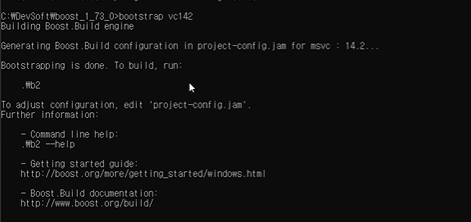

# FIPS
## Table of Contents  
1. [Boost:](#boost)
   - [Download and Install:](#boost_download_and_install)
   - [Integration to Visual Studio Project:](#integration)
 2. [OpenSSL:](#openssl)  

_______
### Boost: Download and Install ###
<a name="boost"/>
<a name="boost_download_and_install"/>
1. Download boost 1.72 library from: https://www.boost.org/users/history/version_1_72_0.html<br />
2. Extract boost folder into: C:\Program Files<br />
3. open x64 VS 2017 CMD as Administrator(important) <br />
4. Enter the following commands:

   - “bootstrap vc141” - (vc141 for visual studio 2017 version)<br />
     
   - “b2” - (building boost libraries)<br />
      
      
5. Add boost to environment variables:

   - add new environment variable named “include” and for it’s value insert boost library path (C:\Program Files\boost_1_72_0)<br />
     
   - add another environment variable named “LIB” and enter it it’s value to be : C:\Program Files\boost_1_72_0\stage\lib
     <br />
Note: the path in the pictures above should be set  as described in 1,2 above.<br />
 6. Build boost libraries:
    -  *Visual Studio 2017 - 32bit Build* <br /> 
    
          ```
          b2 --build-dir=build/x86 address-model=32 threading=multi --build-type=complete --stagedir=./stage/x86 --toolset=msvc-14.1 -j 12 <br />
          ```
 
    -  *Visual Studio 2017 - 64bit Build* <br />
    
          ```
          b2 --build-dir=build/x64 address-model=64 threading=multi --build-type=complete --stagedir=./stage/x64 --toolset=msvc-14.1 -j 12 <br />
          ```
  
    - go to environment variables and modify LIB and change it’s path to be: C:\Program Files\boost_1_72_0\stage\x64\lib
      <br />
    - Add to environment variable named “path” the value: C:\Program Files\boost_1_72_0\stage\x64\lib

For more information:<br />
https://www.youtube.com/watch?v=5afpq2TkOHc
 _____ 
 
### Boost: Integration to Visual Studio Project ###
<a name="integration"/>

  1. open your project in visual studio <br />
  2. right click on your project -> properties <br />
  3. Set configuration to All configuration!important! <br />
  4. Go to Configuration properties -> VC++ Directories, add the path: “C:\Program Files\boost_1_72_0”  to Include directories and to library directories
      -  <br />
  5. Go to C/C++ General and add “C:\Program Files\boost_1_72_0”  to Additional Include Directories, and set SDL checks to No.
      -  <br />
  6. Go to Linker -> General and add the path “C:\Program Files\boost_1_72_0\stage\lib” to  Additional Library Directories
      - <br />


   


